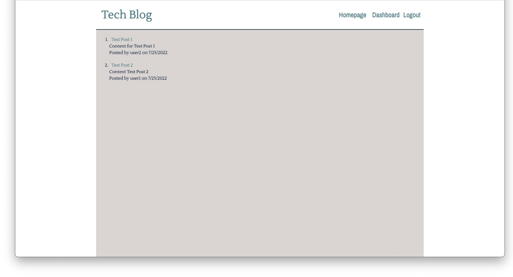

# Tech Blog

## Table of Contents
- [Description](#description)
- [Deployment](#deployment)
- [License](#license)
- [Questions](#questions)

## Description:

This is a CMS-style blog site where developers can sign up for free so they can publish their tech blog posts, have other developers comment on their blog posts, as well as comment on other developer's blog posts. Developer's can only post blogs, comment on other blogs, and edit or delete their own blog posts if they are logged in. This website was build following the MVC architectural structure, using Handlebars.js, Sequelize, and express-sessions. 

## Deployment

The website is deployed using Heroku and is live and ready to use by clicking on the link. Once you've loaded the website starting blogging by clicking on 'Login' in the navigation bar. Since you are a new user you will need to fill out the 'Sign Up' Form but once that is done you will only need to login for any future visits to the site. Happy Blogging!

[Tech Blog](https://cms-style-techblog16.herokuapp.com/)

## License

For information regarding this license please click on the link below.

[MIT License](https://choosealicense.com/licenses/mit/)

## Questions

If you have any questions about this application or if you would like to contribute to further development please contact me at:
- GitHub: [ckoehler16](https://github.com/ckoehler16)

or

- Email: ckoehler16@gmail.com

## Thank You

